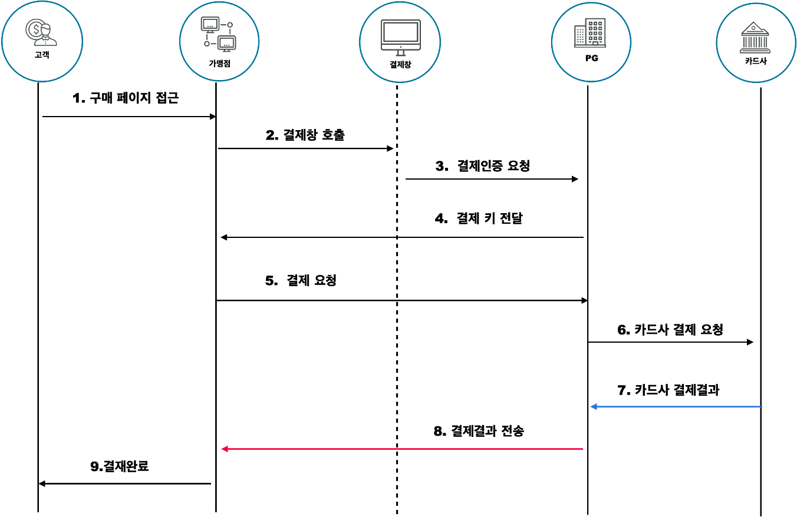
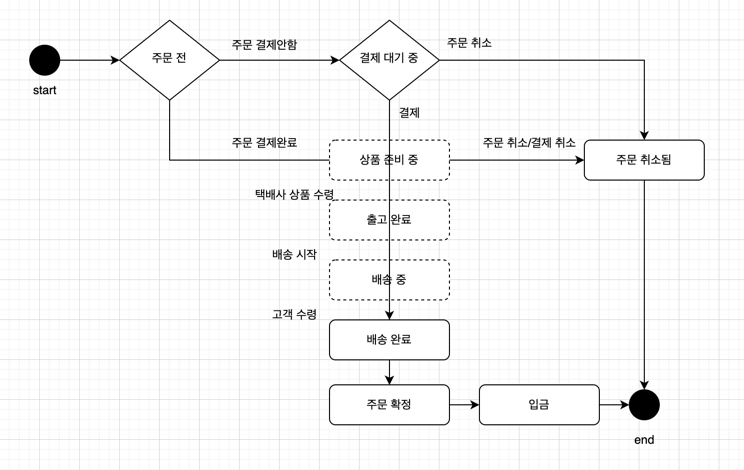

# kotlin-multi-module-sample

코프링 멀티모듈
아임포트 결제모듈 토이프로젝트

- JDK 17
- SpringBoot: 3.0.5
- kotlinVersion: 1.7.22

> 모듈 구성

- escro-payment-front
  - payment-front-api
    - SpringBoot + Kotlin
  - payment-front-ui
    - Vue3 + TypeScript + Vite
- customer-api
- order-api
- payment-api
- product-api
  - SpringBoot + Kotlin
- customer-rds-entity
- order-rds-entity
- payment-rds-entity
- product-rds-entity
  - SpringBoot + Kotlin
  - MySQL
- common
  - SpringBoot + Kotlin
- buildSrc
  - Project Library and Version Management

---

# 에스크로 토이 프로젝트 기획

아임포트의 에스크로 결제 기능을 이용해 구매자와 판매자 간의 안전한 거래를 지원하는 토이 프로젝트.

## 기능 정리

1. 회원 가입 및 로그인 기능
2. 상품 등록 및 조회 기능
3. 에스크로 결제 요청
4. 에스크로 결제 확인 및 승인
5. 에스크로 환불 및 취소

## API 문서

### 회원 가입 및 로그인

1. **POST /auth/signup**

- 요청: 이메일, 비밀번호, 이름 등 회원 정보
- 응답: 성공 여부, 메시지

2. **POST /auth/login**

- 요청: 이메일, 비밀번호
- 응답: 성공 여부, 메시지, JWT 토큰

### 상품 등록 및 조회

1. **POST /products**

- 요청: 상품명, 상품 설명, 가격, 재고 수
- 응답: 성공 여부, 메시지, 상품 ID

2. **PUT /products/{productId}**

- 요청 : 상품명, 상품 설명, 가격, 재고 수
- 응답 : 성공 여부, 메시지

3. **GET /products**

- 요청: 없음
- 응답: 상품 리스트

### 에스크로 결제 요청

1. **POST /payments**

- 요청: 상품 ID, 구매자 ID, 판매자 ID, 가격, 에스크로 옵션 활성화
- 응답: 아임포트 결제 ID, 에스크로 결제 정보

### 에스크로 결제 확인 및 승인

1. **GET /payments/{paymentId}/status**

- 요청: 결제 ID
- 응답: 결제 상태, 결제 정보

2. **POST /payments/{paymentId}/confirm**

- 요청: 결제 ID
- 응답: 성공 여부, 메시지

### 에스크로 환불 및 취소

1. **POST /payments/{paymentId}/refund**

- 요청: 결제 ID, 환불 사유
- 응답: 성공 여부, 메시지

2. **POST /payments/{paymentId}/cancel**

- 요청: 결제 ID
- 응답: 성공 여부, 메시지

---

## 테이블 구조

### 1. 유저 테이블 (users)

| 컬럼명       | 타입      | 설명                   |
| ------------ | --------- | ---------------------- |
| user_id (PK) | INT       | 사용자 고유 식별자     |
| username     | VARCHAR   | 사용자 아이디          |
| password     | VARCHAR   | 비밀번호 (암호화 필수) |
| email        | VARCHAR   | 이메일 주소            |
| name         | VARCHAR   | 사용자 이름            |
| phone        | VARCHAR   | 전화번호               |
| created_at   | TIMESTAMP | 생성일시               |
| updated_at   | TIMESTAMP | 수정일시               |

### 2. 상품 테이블 (products)

| 컬럼명          | 타입      | 설명                                   |
| --------------- | --------- | -------------------------------------- |
| product_id (PK) | INT       | 상품 고유 식별자                       |
| user_id (FK)    | INT       | 사용자 고유 식별자 (users 테이블 참조) |
| name            | VARCHAR   | 상품명                                 |
| description     | TEXT      | 상품 설명                              |
| price           | DECIMAL   | 상품 가격                              |
| stock           | INT       | 재고 수량                              |
| created_at      | TIMESTAMP | 생성일시                               |
| updated_at      | TIMESTAMP | 수정일시                               |

### 3. 주문 테이블 (orders)

| 컬럼명        | 타입      | 설명                                                           |
| ------------- | --------- | -------------------------------------------------------------- |
| order_id (PK) | INT       | 주문 고유 식별자                                               |
| user_id (FK)  | INT       | 사용자 고유 식별자 (users 테이블 참조)                         |
| status        | VARCHAR   | 주문 상태 (예: 결제 대기, 결제 완료, 배송 중, 배송 완료, 취소) |
| total_amount  | DECIMAL   | 총 주문 금액                                                   |
| created_at    | TIMESTAMP | 생성일시                                                       |
| updated_at    | TIMESTAMP | 수정일시                                                       |

### 4. 주문 상품 테이블 (order_items)

| 컬럼명             | 타입      | 설명                                    |
| ------------------ | --------- | --------------------------------------- |
| order_item_id (PK) | INT       | 주문 상품 고유 식별자                   |
| order_id (FK)      | INT       | 주문 고유 식별자 (orders 테이블 참조)   |
| product_id (FK)    | INT       | 상품 고유 식별자 (products 테이블 참조) |
| quantity           | INT       | 상품 수량                               |
| price              | DECIMAL   | 상품 가격                               |
| created_at         | TIMESTAMP | 생성일시                                |
| updated_at         | TIMESTAMP | 수정일시                                |

### 5. 결제 테이블 (payments)

| 컬럼명          | 타입      | 설명                                                  |
| --------------- | --------- | ----------------------------------------------------- |
| payment_id (PK) | INT       | 결제 고유 식별자                                      |
| order_id (FK)   | INT       | 주문 고유 식별자 (orders 테이블 참조)                 |
| user_id (FK)    | INT       | 사용자 고유 식별자 (users 테이블 참조)                |
| amount          | DECIMAL   | 결제 금액                                             |
| payment_method  | VARCHAR   | 결제 수단 (아임포트, 나이스페이)                      |
| payment_status  | VARCHAR   | 결제 상태 (예: 결제 대기, 결제 완료, 결제 취소, 환불) |
| escrow_status   | VARCHAR   | 에스크로 상태 (예: 활성, 비활성)                      |
| created_at      | TIMESTAMP | 생성일시                                              |
| updated_at      | TIMESTAMP | 수정일시                                              |

## 테이블 관계

- users (1:N) orders
- users (1:N) payments
- products (1:N) order_items
- products (N:M) products
- orders (1:N) order_items
- orders (1:1) payments

# 포트원(아임포트) 개발자센터 주소

https://developers.portone.io/docs/ko/readme

## 인증결제는 인증방법에 따라 전통적으로 아래 두가지 형태 구분

- ISP 결제 : 공개키 기반의 전자인증서를 통해 사전에 등록된 카드정보를 인증하는 방식
- MPI 결제 : 카드번호, CVC, 안심클릭 비밀번호를 입력하여 카드정보를 인증하는 방식

## 에스크로 지원 PG사 목록

- KG이니시스
- NHN KCP
- 페이조아(다우테이타)
- 스마트로-신모듈

## 포트원 API 목록

https://developers.portone.io/docs/ko/api/api

## 결제 화면 만들기

https://developers.portone.io/docs/ko/auth/guide/1

## 결제 결과 웹훅

https://developers.portone.io/docs/ko/result/webhook

## 결제 취소 화면 만들기

https://developers.portone.io/docs/ko/auth/guide-2/readme

### 필요 기능 정리

* 참고 - https://everydayyy.tistory.com/89

* 

* [x]  프론트 - js 라이브러리 추가
* [x]  백엔드 - gradle 아임포트 SDK 추가
* [ ]  백엔드 - 검증 API 호출 (프론트에서 값 전달 : /verifyIamport/{imp_uid})
* [ ]  백엔드 - 배송정보 유효성 검증
* [ ]  백엔드 - 결제 성공시에 작동하는 주문 비즈니스 로직
* [ ]  백엔드 이벤트 - 결제 성공  
  배송객체 생성 
  주문객체 생성, delivery와 매핑 
  주문아이템 객체 생성, order와 매핑 
  장바구니사용자라면 구매한 장바구니 객체 삭제
* [ ]  배송완료 이벤트 발행
* [ ]  에스크로 배송 완료 후 n일 || 주문 확정 / 주문 교환,취소 
  완료 시 - 주문 완료 
  교환취소 시 - 주문 교환,취소리